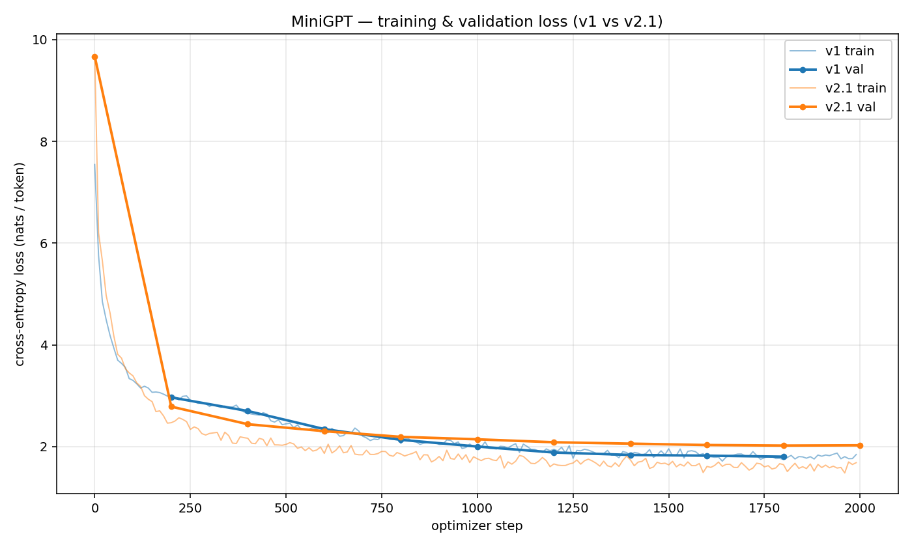
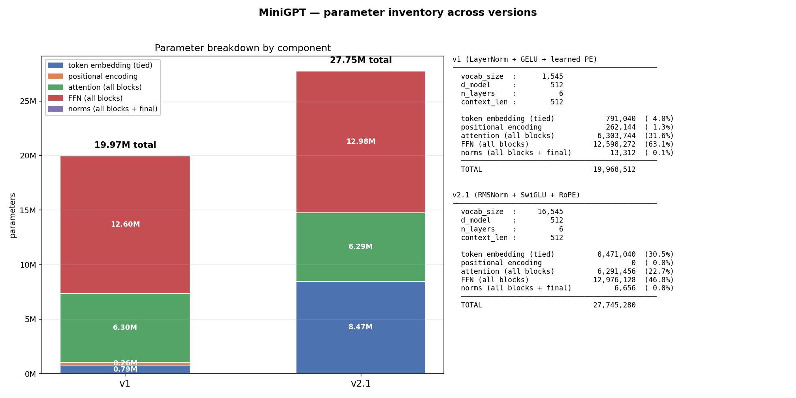

# MiniGPT

A from-scratch, decoder-only transformer: custom byte-pair-encoding
tokenizer, custom training loop, and the architecture itself — no
`nn.Transformer`, no HuggingFace model code. Trained on a ~37 MB English
corpus (Wikitext-103 + TinyStories sample) on an Apple-Silicon MacBook Air
using MPS. The point was to understand the architecture by building it, not
to compete on benchmarks. Sizing follows the empirical scaling results in the
[Chinchilla paper](https://arxiv.org/pdf/2203.15556).

Two trained variants:

- **v1** — GPT-2 style: LayerNorm, GELU MLP, learned positional embeddings,
  hand-rolled scaled-dot-product attention.
- **v2.1** — Llama style: RMSNorm, SwiGLU, RoPE, fused SDPA attention,
  GPT-2 scaled residual init, bias-free projections, 16k BPE vocab.

---

## Headline result

| | v1 | v2.1 |
|---|---|---|
| Parameters | 19.97 M | 27.75 M |
| Vocab | 1,545 | 16,545 |
| Final val loss (step 1800) | **1.802** | 2.021 |
| **Bits per byte** (apples-to-apples) | 1.362 | **1.252** |
| Train / val gap (step 1800) | 0.06 | 0.38 |
| Tok/s on MPS (avg) | ~4,000 | ~2,000 |
| Wall-clock (2000 steps) | ~5 h | ~6 h |

v2.1 is **~8 % better in bits-per-byte** despite the higher raw val loss —
the two models have different vocabularies, so their absolute losses are on
different scales. v2.1 also clearly **overfits**, which v1 never did. That
is the expected outcome of putting a larger model on the same small corpus:
the architecture changes did what they were supposed to, and the bottleneck
moved to **data**.




---

## Architecture (v2.1)

Each block is the Llama-style pre-norm pattern:

```
x ← x + Attention( RMSNorm(x) )
x ← x + SwiGLU(    RMSNorm(x) )
```

Stacked 6 deep, with a final RMSNorm and an output head tied to the token
embedding. RoPE is applied to `Q` and `K` inside attention instead of being
added to the input embedding, so nothing positional enters the residual
stream.

```
ids  (B, T) ──► token embedding (16545 × 512, tied)
                       │
                       ▼
                 GPTEmbedding (+ dropout, no positional add)
                       │
        ┌──────────────▼───────────────┐
        │  TransformerBlock × 6         │
        │   RMSNorm → Attention(SDPA,   │
        │             RoPE) → +res      │
        │   RMSNorm → SwiGLU → +res     │
        └──────────────┬───────────────┘
                       │
                  final RMSNorm
                       │
              linear head (tied)
                       │
                       ▼
              logits  (B, T, 16545)
```

Where the parameters live (v2.1, exact counts):

| Component | Parameters |
|---|---|
| Token embedding (tied with the head) | 8,471,040 |
| Positional encoding (RoPE) | 0 |
| Attention, all 6 blocks | 6,291,456 |
| SwiGLU FFN, all 6 blocks | 12,976,128 |
| RMSNorms, all blocks + final | 6,656 |
| **Total** | **27,745,280** |

Weight tying makes the input embedding and the output head the same
`Parameter`, so that 8.47 M matrix is counted and trained once. v1's
equivalent total is 19,968,512; `scripts/plot_params.py` holds the full
per-component breakdown for both and renders the chart above.

---

## What changed from v1 to v2.1

Everything not listed here was held constant — optimizer, LR schedule,
effective batch of 64, dropout 0.1 — so the comparison is honest.

**Tokenizer: 1k → 16k merges, vocab 1,545 → 16,545.** The trainer was
rewritten to the classical Sennrich et al. (2016) form — word-frequency dict
plus an incremental pair counter with a reverse index `pair → {word indices}`,
so each merge only touches the words containing it. That is
`O(affected_words × num_merges)` instead of `O(corpus × num_merges)`, which
took 16k merges from a projected ~19 hours to ~5 minutes with identical
output. The corpus re-encodes to **15.96 M tokens** versus v1's 19.5 M.

**Dropped the `√d_model` scaling on token embeddings.** With `std=0.02` init
it gives magnitudes around 10 where RMSNorm expects ~1. GPT-2 and Llama both
drop it.

**Learned positional embeddings → RoPE.** A learned table gives each absolute
position its own vector, so the model has no notion that 48 follows 47, and
past `context_len` there is no vector at all. RoPE rotates `Q` and `K` by an
angle proportional to position, so `Q·K` depends on the relative offset
`(i − j)` — zero parameters, and it extrapolates. (The v1 learned and
sinusoidal encodings still live in `embeddings/positional_encoding.py`.)

**LayerNorm → RMSNorm.** Pre-norm activations already sit near zero mean, so
the mean-subtraction is redundant. Dividing by `sqrt(mean(x²))` alone is
faster and has fewer parameters.

**Manual attention → `F.scaled_dot_product_attention`.** The old path ran
`Q·Kᵀ → mask → softmax → ·V` as four ops, each materializing the
`(B, h, T, T)` matrix and reading it back. SDPA fuses them and never writes
it out, which is ~1.5–2× faster on bandwidth-bound MPS.

**GELU MLP → SwiGLU.** `silu(W_gate·x) ⊙ (W_up·x)` then `W_down`, so a gate
learns which features to open per token; reported at ~5–10 % better
validation loss for the same parameter count (Shazeer 2020, Llama). Three
matrices instead of two, so `d_ff` dropped 2048 → 1408 (≈ ⅔, multiple of 64).

**GPT-2 scaled residual init.** `attn.out_proj` and `swiglu.w_down` — the
projections that write into the residual stream — start at
`std = 0.02 / √(2·n_layers)`, a ~0.41 multiplier at 6 layers, so activations
don't compound with depth.

**Bias-free projections.** Llama convention: the next norm removes any
constant offset, so the biases carry nothing.

**Training-loop hygiene.** Val eval at step 0 so the random-init baseline
(`≈ ln(vocab) ≈ 9.7`) is measured, not inferred; a final eval after the last
step, which the old `step > start_step` guard skipped; gradient norm printed
every log step as an early instability signal; `torch.compile` with eager
failover; `pin_memory` only on CUDA.

---

## Analysis

### The train/val gap

v2.1's validation loss improved quickly and then stopped: 9.67 at step 0,
2.79 by 200, 2.19 by 800, 2.09 by 1200, and 2.021 at 1800 — then **up** to
2.026 at step 2000, while train loss kept falling to 1.685. That is
data-starvation overfitting, and the train/val gap of 0.38 (against v1's
0.06) says the same thing.

Two things compound here:

1. **Capacity.** v2.1 is ~40 % larger than v1 on the same data at the same
   dropout, so it has memorization capacity to spare. v1 never overfit
   because it never had the room to.
2. **Split mismatch.** `split_dataset` takes the last 10 % of the contiguous
   token stream as validation. The corpus is ordered (wikitext articles,
   then tinystories), so val is drawn from a slightly different distribution
   than train. The tokenizer is also trained on only the first 5 MB, which
   biases the merges toward the train side and inflates val loss further.

### The throughput regression

v2.1 ran at ~2,000 tok/s against v1's ~4,000 on the same machine, despite
SDPA and bf16. Where it went:

| Cost added | Impact |
|---|---|
| Output head: vocab 1,545 → 16,545 | 11× more compute in the head matmul + softmax — this one change dominates |
| SwiGLU: 2 matrices → 3 | +50 % FFN compute, even at the smaller `d_ff` |
| RMSNorm fp32 cast | small constant overhead per norm |
| SDPA on MPS | ~1.5–2× faster attention (real, but nowhere near enough to offset the above) |
| MacBook Air thermal throttling | sustained throughput drops 30–50 % from peak on passive cooling |

So v2.1 trades raw throughput for information per token, and the tokenizer's
19.5 M → 15.96 M compression means fewer tokens are needed to see the same
text, which partially offsets it.

Quantization is the wrong tool for the rest. INT8 is an inference
technique; training needs precise gradients, and the only "quantization"
that helps training is bf16/fp16 mixed precision, which v2.1 already uses.
The real levers are bigger batches (already at 32), `torch.compile`, active
cooling, or a bigger GPU.

---

## Conclusion

**The architecture changes worked.** v2.1 reaches better per-byte quality
than v1 at every comparable step. RoPE, RMSNorm, SwiGLU, SDPA and scaled
init are all unambiguous wins at this scale.

**The bottleneck is now data, not architecture.** Chinchilla's rule of ~20
tokens per parameter puts compute-optimal training for v2.1 at ~554 M unique
tokens, and this corpus has 15.96 M — about 5 % of that (v1's ratio was
4.9 % of its own ~399 M target). v1 didn't overfit because it couldn't; v2.1
can and does, and no additional steps over the same corpus will move val
loss now that the curve has flattened.

**So the next step is more data, not more steps.** Scaling to ~554 M tokens
(FineWeb-Edu) for one compute-optimal pass would unlock the rest of v2.1's
capacity, but at ~2,000 tok/s that is ~77 hours on a MacBook Air. The
sensible path is a free Colab T4 (~8 h) or a rented A100 (~1 h). This
project deliberately stops here: the architecture work is done and the
findings are clean, and the scale-up is an infrastructure job rather than a
research one.

---

## Quick start

```bash
python -m venv venv && source venv/bin/activate
pip install -e ".[dev]"                       # core deps + pytest

python scripts/build_corpus.py                # ~50k docs from HuggingFace
PYTHONPATH=src python -m minigpt.tokenizer.train_tokenizer   # 16k merges, ~5 min
PYTHONPATH=src python -m minigpt.data.dataset # encode the corpus (cached)
PYTHONPATH=src python -m minigpt.train        # 2000 steps

python scripts/plot_loss.py                   # figures/loss_comparison.png
python scripts/plot_params.py                 # figures/param_breakdown.png

PYTHONPATH=src python -m minigpt.generate \
    --ckpt checkpoints/step_002000.pt --prompt "Once upon a time"

pytest                                        # unit tests
```

Tested on Python 3.9, PyTorch 2.8, macOS 15.7, Apple M-series MPS. The
tokenizer, the encoded corpus and the checkpoints are all gitignored — the
commands above regenerate them.

---

## Repository layout

```
src/minigpt/  config.py (all hyperparameters) · tokenizer/ (custom BPE)
              embeddings/ (token + v1 positional) · model/ (attention, rotary,
              rms_norm, feed_forward, transformer_block, gpt)
              data/dataset.py · train.py · generate.py
scripts/      build_corpus.py, plot_loss.py, plot_params.py
tests/        pytest suite: tokenizer, model, dataset, generation, train
logs/         training CSVs from both runs · figures/ the plots above
```

---

## Future work

1. Chunk-shuffled train/val split instead of the contiguous tail — likely
   closes 0.1–0.2 of the gap with no retraining.
2. Memory-mapped `CorpusDataset` (`numpy.uint16`): 4.4 GB of RAM at 554 M
   tokens becomes under 100 MB. Required before any data scale-up.
3. FineWeb-Edu streaming pipeline into that memmap, then training on a cloud
   GPU — the loop is already device-agnostic via `get_device()`.
4. Early stopping on best val loss rather than last step, and a
   `bits_per_byte()` utility so cross-vocab comparisons stop being manual.

---

## References

Vaswani et al. (2017), *Attention Is All You Need*. Radford et al. (2019),
*GPT-2* (scaled residual init, §2.3). Sennrich et al. (2016), *Subword
Units* (BPE training). Su et al. (2021), *RoFormer* (RoPE). Zhang & Sennrich
(2019), *RMSNorm*. Shazeer (2020), *GLU Variants Improve Transformer*.
Touvron et al. (2023), *Llama*. Hoffmann et al. (2022), *Chinchilla* (the
~20 tokens per parameter heuristic).
